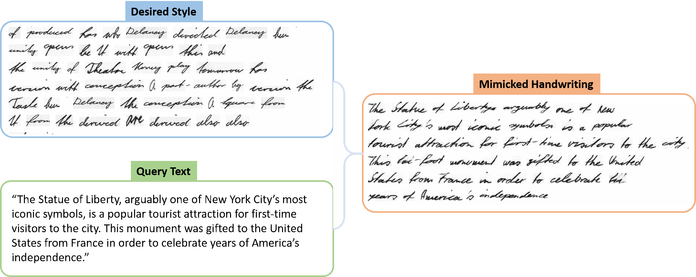
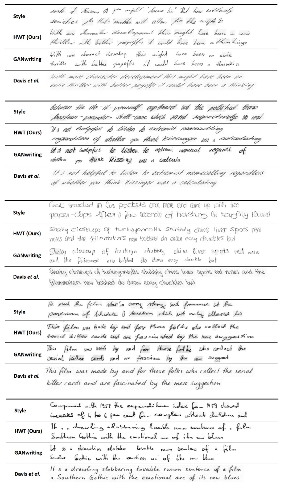
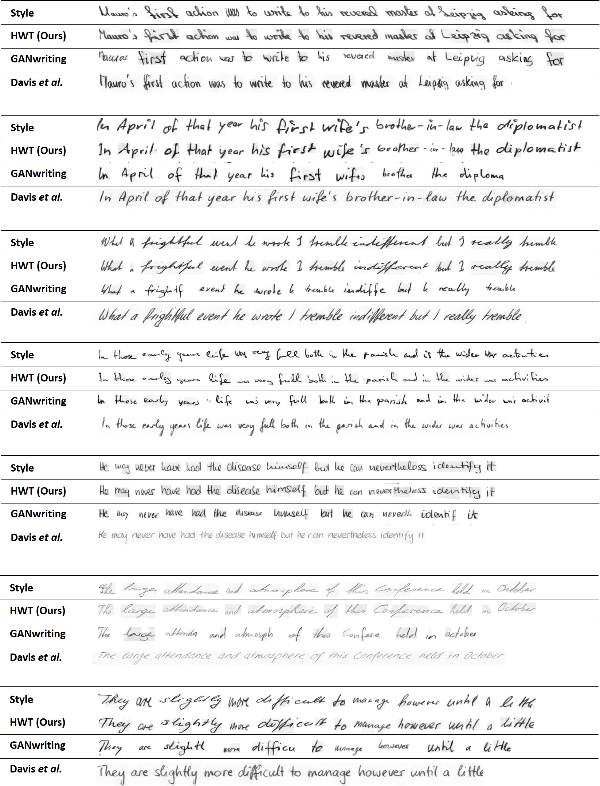

# :zap: Handwriting Transformers  [](https://colab.research.google.com/github/ankanbhunia/Handwriting-Transformers/blob/main/demo.ipynb)
<!-- 
[arXiv](https://arxiv.org/abs/2112.10752) | [paper](https://openaccess.thecvf.com/content/ICCV2021/papers/Bhunia_Handwriting_Transformers_ICCV_2021_paper.pdf) | [Huggingface-demo](https://huggingface.co/spaces/ankankbhunia/HWT) | [Colab-demo](https://colab.research.google.com/github/ankanbhunia/Handwriting-Transformers/blob/main/demo.ipynb) | [BibTeX](#bibtex)
  -->

  
 <p align='center'>
  <b>
    <a href="https://ankanbhunia.github.io/Handwriting-Transformers/">Project</a>
    |
    <a href="https://arxiv.org/abs/2104.03964">ArXiv</a>
    | 
    <a href="https://openaccess.thecvf.com/content/ICCV2021/papers/Bhunia_Handwriting_Transformers_ICCV_2021_paper.pdf">Paper</a>
    | 
    <a href="https://ankankbhunia-hwt.hf.space/">Huggingface-demo</a>
    | 
    <a href="https://colab.research.google.com/github/ankanbhunia/Handwriting-Transformers/blob/main/demo.ipynb">Colab-demo</a>
  </b>
</p> 

 
 <p align="center">

</p>


## News

- **2024.02** Test the model using custom handwriting samples:

-
  :rocket:
  [A Huggingface demo is now available and running](https://huggingface.co/spaces/ankankbhunia/HWT)
- 
  :rocket:
  [Colab demo for custom handwritings](https://colab.research.google.com/github/ankanbhunia/Handwriting-Transformers/blob/main/demo_custom_handwriting.ipynb)
- 
  :rocket:
  [Colab demo for IAM/CVL dataset](https://colab.research.google.com/github/ankanbhunia/Handwriting-Transformers/blob/main/demo.ipynb)

<!-- 

 -->


 ## Abstract
 
[Ankan Kumar Bhunia](https://scholar.google.com/citations?user=2leAc3AAAAAJ&hl=en),
[Salman Khan](https://scholar.google.com/citations?user=M59O9lkAAAAJ&hl=en),
[Hisham Cholakkal](https://scholar.google.com/citations?user=bZ3YBRcAAAAJ&hl=en), 
[Rao Muhammad Anwer](https://scholar.google.fi/citations?user=_KlvMVoAAAAJ&hl=en),
[Fahad Shahbaz Khan](https://scholar.google.ch/citations?user=zvaeYnUAAAAJ&hl=en&oi=ao) &
[Mubarak Shah](https://scholar.google.com/citations?user=p8gsO3gAAAAJ&hl=en)


> **Abstract:** 
>*We propose a novel transformer-based styled handwritten text image generation approach, HWT, that strives to learn both style-content entanglement as well as global and local writing style patterns. The proposed HWT captures the long and short range  relationships within the style examples through a self-attention mechanism, thereby encoding both global and local style patterns. Further, the proposed transformer-based HWT comprises an encoder-decoder attention that enables style-content entanglement by gathering the style representation of each query character. To the best of our knowledge, we are the first to introduce a transformer-based generative network for styled handwritten text generation. Our proposed HWT generates realistic styled handwritten text images and significantly outperforms the state-of-the-art demonstrated through extensive qualitative, quantitative and human-based evaluations. The proposed HWT can handle arbitrary length of text and any desired writing style in a few-shot setting. Further, our HWT generalizes well to the challenging scenario where both words and writing style are unseen during training, generating realistic styled handwritten text images.* 


## Software environment

- Python 3.7
- PyTorch >=1.4

## Setup & Training

Please see ```INSTALL.md``` for installing required libraries. You can change the content in the file ```mytext.txt``` to visualize generated handwriting while training.   


Download Dataset files and models from https://drive.google.com/file/d/16g9zgysQnWk7-353_tMig92KsZsrcM6k/view?usp=sharing and unzip inside ```files``` folder. In short, run following lines in a bash terminal. 

```bash
git clone https://github.com/ankanbhunia/Handwriting-Transformers
cd Handwriting-Transformers
pip install --upgrade --no-cache-dir gdown
gdown --id 16g9zgysQnWk7-353_tMig92KsZsrcM6k && unzip files.zip && rm files.zip
```

To start training the model: run

```
python train.py
```

If you want to use ```wandb``` please install it and change your auth_key in the ```train.py``` file (ln:4). 

You can change different parameters in the ```params.py``` file.

You can train the model in any custom dataset other than IAM and CVL. The process involves creating a ```dataset_name.pickle``` file and placing it inside ```files``` folder. The structure of ```dataset_name.pickle``` is a simple python dictionary. 

```python
{
'train': [{writer_1:[{'img': <PIL.IMAGE>, 'label':<str_label>},...]}, {writer_2:[{'img': <PIL.IMAGE>, 'label':<str_label>},...]},...], 
'test': [{writer_3:[{'img': <PIL.IMAGE>, 'label':<str_label>},...]}, {writer_4:[{'img': <PIL.IMAGE>, 'label':<str_label>},...]},...], 
}
```
 ## Run Demo using Docker
```
 docker run -it -p 7860:7860 --platform=linux/amd64 \
	registry.hf.space/ankankbhunia-hwt:latest python app.py
 ```

## Handwriting synthesis results

Please check the ```results``` folder in the repository to see more qualitative analysis. Also, please check out colab demo to try with your own custom text and writing style [](https://colab.research.google.com/github/ankanbhunia/Handwriting-Transformers/blob/main/demo.ipynb)

 <p align="center">

</p>

 <p align="center">

</p>


## Handwriting reconstruction results
 Reconstruction results using the proposed HWT in comparison to GANwriting and Davis et al. We use
the same text as in the style examples to generate handwritten images.

 <p align="center">

</p>

<!-- 



 -->


## Citation

If you use the code for your research, please cite our paper:

```
@InProceedings{Bhunia_2021_ICCV,
    author    = {Bhunia, Ankan Kumar and Khan, Salman and Cholakkal, Hisham and Anwer, Rao Muhammad and Khan, Fahad Shahbaz and Shah, Mubarak},
    title     = {Handwriting Transformers},
    booktitle = {Proceedings of the IEEE/CVF International Conference on Computer Vision (ICCV)},
    month     = {October},
    year      = {2021},
    pages     = {1086-1094}
}
```

