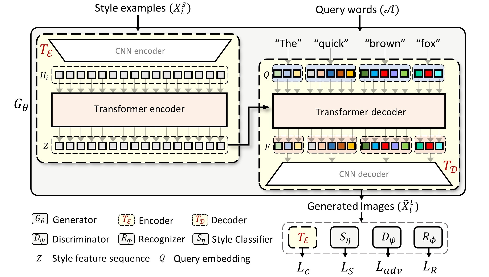

# Handwriting Transformers **[[arXiv]](https://arxiv.org/abs/xxxxxxx)** 

[Ankan Kumar Bhunia](https://scholar.google.com/citations?user=2leAc3AAAAAJ&hl=en),
[Salman Khan](https://scholar.google.com/citations?user=M59O9lkAAAAJ&hl=en),
[Hisham Cholakkal](https://scholar.google.com/citations?user=bZ3YBRcAAAAJ&hl=en), 
[Rao Muhammad Anwer](https://scholar.google.fi/citations?user=_KlvMVoAAAAJ&hl=en),
[Fahad Shahbaz Khan](https://scholar.google.ch/citations?user=zvaeYnUAAAAJ&hl=en&oi=ao) &
[Mubarak Shah](https://scholar.google.com/citations?user=p8gsO3gAAAAJ&hl=en)

> **Abstract:** 
>*We propose a novel transformer-based styled handwritten text image generation approach, HWT, that strives to learn both style-content entanglement as well as global and local writing style patterns. The proposed HWT captures the long and short range  relationships within the style examples through a self-attention mechanism, thereby encoding both global and local style patterns. Further, the proposed transformer-based HWT comprises an encoder-decoder attention that enables style-content entanglement by gathering the style representation of each query character. To the best of our knowledge, we are the first to introduce a transformer-based generative network for styled handwritten text generation. Our proposed HWT generates realistic styled handwritten text images and significantly outperforms the state-of-the-art demonstrated through extensive qualitative, quantitative and human-based evaluations. The proposed HWT can handle arbitrary length of text and any desired writing style in a few-shot setting. Further, our HWT generalizes well to the challenging scenario where both words and writing style are unseen during training, generating realistic styled handwritten text images.* 

## Code release coming soon!

